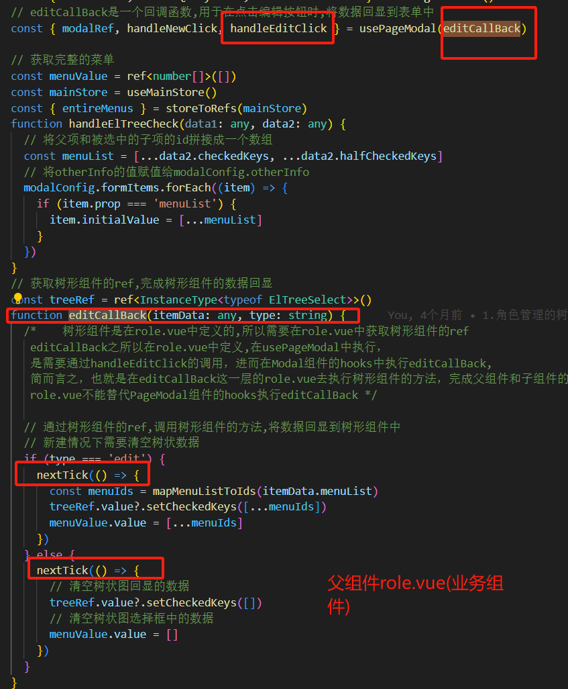
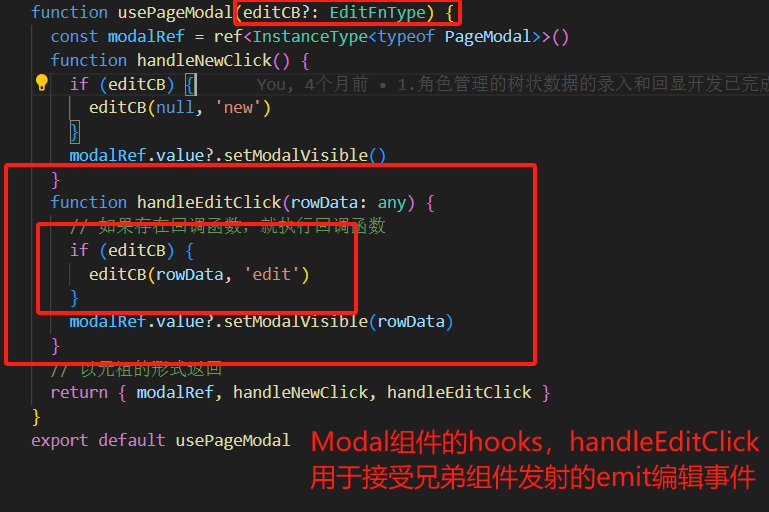
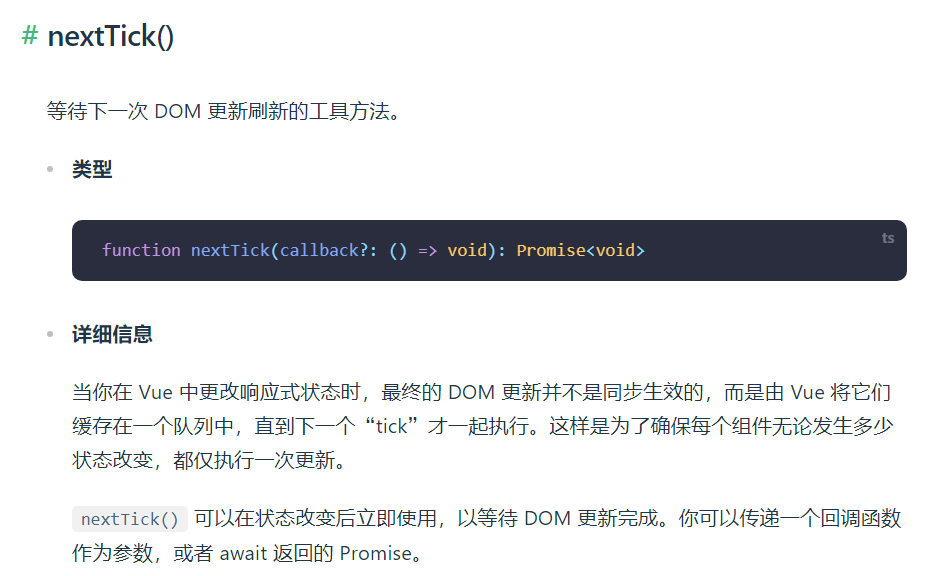

# Vue3-CMS

一个手把手教你如何一步步建立基于Vue3全家桶、Typescript、Echart、Pinia、ElementPlus的后台管理系统

**本文档设有详细的大纲讲解，建议您获取本项目到本地后，使用专用的阅读器打开阅读，使用体验更佳。如果您喜欢本项目，恳请您赏一个star，感激不尽！**

这是一套结合了应用高阶组件并且对业务功能进行了分类封装的后台管理系统，能够更好地实现快速应用业务数据和快速生成各类业务组件模版，并且集合了关联网络请求的鉴权模块设计、动态适配用户权限来应用不同类型的功能模块

在这个项目中，提供了一套成熟且合理的代码提交流程规范，并且对整体项目进行了更好的封装和解耦，使得功能模块更具有拓展性和通用性，方便了开发者更加合理地进行开发设计

在该项目的说明文档中，采取了一步一步非常细化的后台管理系统开发讲解，方便入门开发者也能轻易上手和学习如何合理地开发一套后台管理系统，如何理清网络封装、鉴权设计、高阶组件的设计思路，采取步步为营的方式在这个文档里为你提供事无巨细的开发向导

同时，项目也提供了丰富的代码注释，方便你更好的理解对应的开发思路

同时，**本项目有配套开发的后端项目**，用于给本项目提供接口和Demo数据，后端项目基于**NodeJS**和**Koa**进行开发，如果有兴趣了解，请移步：https://github.com/Suzumiya-Tiger/LyokoHUB

**本项目未对用户管理的业务组件进行抽离和封装操作，是为了方便开发者理解/简单使用业务组件来进行开发，其它业务页面均进行了抽离和高度模块化的封装设计，望知悉**

## 推荐的IDE设置

[VSCode](https://code.visualstudio.com/) + [Volar](https://marketplace.visualstudio.com/items?itemName=Vue.volar) (and disable Vetur) + [TypeScript Vue Plugin (Volar)](https://marketplace.visualstudio.com/items?itemName=Vue.vscode-typescript-vue-plugin).

# 项目开发向导

## 代码规范配置

### 1.使用editorConfig统一配置

```
# http://editorconfig.org

root = true

[*] # 表示所有文件适用
charset = utf-8 # 设置文件字符集为 utf-8
indent_style = space # 缩进风格（tab | space）
indent_size = 2 # 缩进大小
end_of_line = lf # 控制换行类型(lf | cr | crlf)
trim_trailing_whitespace = true # 去除行尾的任意空白字符
insert_final_newline = true # 始终在文件末尾插入一个新行

[*.md] # 表示仅 md 文件适用以下规则
max_line_length = off
trim_trailing_whitespace = false
```

### 2.使用prettier工具配置

```
pnpm install prettier -D
```

在.prettierrc进行配置

```
{
 "$schema": "https://json.schemastore.org/prettierrc",
 "semi": false,
 "tabWidth": 2,
 "singleQuote": true,
 "printWidth": 80,
 "trailingComma": "none"
}
```

### 3.使用ESLint检测配置

```
pnpm install eslint-plugin-prettier eslint-config-prettier -D
```

在**.eslintrc.cjs**中进行配置

```javascript
module.exports = {
 root: true,
 extends: [
  'plugin:vue/vue3-essential',
  'eslint:recommended',
  '@vue/eslint-config-typescript',
  '@vue/eslint-config-prettier/skip-formatting',
  // 读取prettierrc.json里面的prettier配置，令其匹配prettier的配置效果
  'plugin:prettier/recommended'
 ],
 parserOptions: {
  ecmaVersion: 'latest'
 },
 rules: {
  'vue/comment-directive': 'off',
  'vue/multi-word-component-names': 'off',
  'no-undef': 'off'
 }
}
```

## git commit规范

注意，本章节的操作前提在于您已经建立了git仓库

### eslint自动校验工具

我们希望保证代码仓库中的代码都是符合eslint规范的，所以我们会在**git commit**时进行代码校验，如果不符合eslint规范，借助husky工具，本项目可以支持自动通过规范修复

- **husky是一个git hook工具，可以帮助我们触发git提交的各个阶段：pre-commit、commit-msg、pre-push**

husky配置命令：

```shell
pnpx husky-init && pnpm install
```

**该命令执行以下操作：**

1.安装husky相关的依赖：

2.在项目目录下创建 `.husky` 文件夹：

3.在package.json中添加一个脚本：

```shell
  "lint": "eslint . --ext .vue,.js,.jsx,.cjs,.mjs,.ts,.tsx,.cts,.mts --fix --ignore-path .gitignore",
```

这保证了执行git commit的时候，会自动对代码进行lint校验

具体实现可以查看本项目下的husky，里面会在提交git的时候自动写入 `npm run lint`

### 统一提交规范工具

我们采用了Commitizen进行git提交风格统一工作

什么是Commitizen ？**Commitizen 是一个帮助编写规范 commit message 的工具**

在本项目中的使用方法如下：

1.安装Commitizen

```shell
pnpm install commitizen -D
```

2.因为Commitizen是依赖于 **cz-conventional-changelog** 的，所以我们需要额外安装**cz-conventional-changelog**，并且初始化**cz-conventional-changelog**

```shell
pnpx commitizen init cz-conventional-changelog  --pnpm --save-dev --save-exact
```

3.在**package.json**中**删除以下配置**：

```shell
 "config": {
  "commitizen": {
   "path": "./node_modules/cz-conventional-changelog"
  }
 }
```

然后在根目录创建.czrc,写入以下内容：

```
{
    "path": "cz-conventional-changelog"
}
```

#### 结合commitlint来约束提交格式

我们可以禁止常规的git commit -m 提交，通过强制推进Commitizen来进行规范化的代码提交，所以我们需要以下工具：

1.安装 **@commitlint/config-conventional** 和 **@commitlint/cli**

```shell
npm i @commitlint/config-conventional @commitlint/cli -D
```

2.在根目录创建**commitlint.config.js**文件，配置commitlint

```javascript
module.exports = {
  extends: ['@commitlint/config-conventional']
}
```

同时我们需要ts编译规避掉这份创建的文件，防止编译失败，所以我们需要在 **tsconfig.json**中针对避免编译的配置项进行设置：

**tsconfig.json**

```
  "exclude": [
    "commitlint.config.js"
  ],
```

3.我们在命令行执行以下命令，从而在husky中生成**commit-msg**文件，该文件用于验证提交信息：

```shell
npx husky add .husky/commit-msg "npx --no-install commitlint --edit $1"
```

**commit-msg**

`pnpx --no-install commitlint --edit `用于检查提交的命令格式是否规范，简而言之就是必须通过 `npx cz` 来提交命令。

```
#!/usr/bin/env sh
. "$(dirname -- "$0")/_/husky.sh"

pnpx --no-install commitlint --edit

```

#### 简化提交命令

通过上述步骤，我们提交项目至git目录的时候，会使得整体代码符合lint规范，同时又符合git提交命令的规范，使得整个提交过程既优雅又规范。

我们还可以直接在 **package.json**里面将 `npx cz`命令写入执行命令之中，以后我们直接输入cz就可以轻松进行提交代码说明了：

**package.json**

```
"commit":"cz"
```

## 文件架构目录

#### 系统梳理和理解向导

**建议阅读和理解的步骤：**

service网络请求架构=>store下的登录业务相关逻辑处理文件 **login.ts** =>配套的**utils**下的各类工具函数=>**router**目录下的入口文件结合登录逻辑的处理

上述的步骤均在 [**登录逻辑的向导分析**](#登录逻辑的向导分析) 章节有极其详尽的讲解，欢迎食用~

**相关工具和组件的说明:**

鉴权关联组件=>菜单，路由，登录逻辑的相关组件

鉴权关联工具=>utils下处理鉴权和登录逻辑的工具

各个组件的通用函数合集的封装=>hooks

### assets

静态资源存放区

### base-ui

引入第三方UI配置(目前暂无，可自定义配置)

### components

组件区

### service

配置网络请求相关信息，config文件夹下包括了BASE_URL和TIME_OUT的配置

在对应的文件夹下，不同的文件名和views文件夹下的文件名同步匹配，对应了各个模块下的service请求

## 自定义配置

### env.d.ts

针对typescript需要编译识别的文件进行了汇总声明，使其可以匹配对应的文件类型

我们需要在这里对Vue进行一个ts编译声明，使TS能够正确识别Vue组件

```
// 声明一个模块，用于给typescript匹配所有以 ".vue" 结尾的文件
// 使得typeScript可以正确识别vue文件到底是一个什么类型(写明具体的模块类型)
declare module '*.vue' {
  // 从 "vue" 中导入 DefineComponent 类型
  import { DefineComponent } from 'vue'
  // 定义一个类型为 DefineComponent 的变量 component
  // 它具有三个泛型参数，分别表示组件的 props、组件的 data 和其他的类型
  // 在这里，我们使用空对象（{}）表示没有 props，使用空对象（{}）表示没有 data，使用 any 表示其他类型可以是任意值
  const component: DefineComponent
  // 导出 component 变量，这样其他地方在导入 ".vue" 文件时，TypeScript 编译器会将它识别为一个 Vue 组件
  export default component
}
```

### tsconfig.json

tsconfig继承(extends)于vue的tsconfig.web配置，但不建议在这里进行配置的修改

include配置需要进行ts编译的文件

**tsconfig.node.json**

是vue官方推荐的修改ts配置的文件

### 区分development和production环境

通过VITE提供的环境变量(import.meta.env)来获取当前环境类型=>**import.meta.env.MODE**

根据MODE类型来进行不同的环境变量条件下的配置

在**service**的**config**文件下根据**MODE**类型的不同，来设置对应环境的**BASE_URL**来发起请求，借此区分开发环境和生产环境，本项目中直接使用了**import.meta.env.PROD**来进行环境区分

当然，您也可以利用vite的env自定义功能，在根目录创建**.env.production**或**.env.development**，vue会自动识别这两种文件对应的环境配置，在各自的文件中创建对应的环境变量信息，来进行两种开发环境的区分，注意文件内部的自定义配置代码必须以**VITE_**开头

## UI库的使用

本项目选取了element-plus作为UI库，应用了element-plus的css样式，将**按需引用**作为应用UI库的配置方法

### 全局安装

```
pnpm install element-plus
```

### 按需引用

#### 快捷开启element-plus组件配置提示(基于Volar支持)

我们先需要对element-plus的type支持进行一个配置，使得我们可以在开发中快捷进行element-plus组件的**prop**类型提示配置

 结合Volar插件(需在代码编辑器中自行安装)的支持，在**tsconfig.json**中通过**compilerOptions.type**指定全局组件类型

我们在**tsconfig.node.json**中进行相关配置：


#### 按需引用的配置

```
pnpm install -D  unplugin-vue-components unplugin-auto-import
```

在vite.config.ts中进行对应的配置


同时，你需要在**tsconfig.config.json**中添加对**components.d.ts**和**auto-imports.d.ts**的支持，以便ts能够正确的识别对应模块自动导入和组件配置文件的编译支持


**请注意，element-plus反馈组件不在自动导入的组件范围之内，建议手动进行导入，导入步骤如下：**

针对反馈插件，部分引入或者全局引入相对繁琐或者不合理，所以只需直接在vite.config.ts中配置vite-plugin-style-import 即可实现样式库的按需引入

执行安装：

```shell
pnpm i -D vite-plugin-style-import
pnpm i -D consola
```

在vite.config.ts之中配置：

```typescript
import {
  createStyleImportPlugin,
  ElementPlusResolve
} from 'vite-plugin-style-import'
```

在plugins中写入以下配置代码：

```typescript
    createStyleImportPlugin({
      resolves: [ElementPlusResolve()],
      libs: [
        {
          libraryName: 'element-plus',
          esModule: true,
          resolveStyle: (name: string) => {
            name = name.substring(3, name.length)
            return `element-plus/es/components/${name}/style/index`
          }
        }
      ]
    })
```

### 全局注册图标(icon)

在global文件夹的register-icon.ts进行全局注册操作

```typescript
import type { App } from 'vue'
// 导入所有的icon图标
import * as ElementPlusIconsVue from '@element-plus/icons-vue'
function registerIcons(app: App<Element>) {
  for (const [key, component] of Object.entries(ElementPlusIconsVue)) {
    // 把所有图标注册成app的全局组件
    app.component(key, component)
  }
}
export default registerIcons
```

在main.ts导入该文件，利用**app.use(icons)**注册即可完成全局注册

# 项目的解析和梳理

## 登录逻辑

通过在**panel-account.vue**之中发送登录信息，获取返回的信息

本项目中多数的网络请求是利用了pinia的actions完成的异步请求，我们在登录逻辑这里定义了一个**loginAccountAction**的function，所有的登录逻辑操作都在这里面完成

### 获取登录信息

我们先在**store**下**login**模块的**login.ts**利用actions写好对应的登录请求，用于获取登录用户的基本信息和角色信息，角色信息是为了鉴权使用的，然后我们将获取到的返回信息保存在**state**当中以供外部引用，同时我们将token保存到本地缓存之中，以便后续登录无需重复请求token

**注意：localCache是已经封装好的本地缓存工具，封装在utils下的cache设计的类中，因为localStorage.setItem获取的值是JSON值，所以为了方便统一封装不同类型的cache值**

##### 获取用户信息和角色信息

```typescript
    async loginAccountAction(account: IAccount) {
      // 1.账号登录，获取token等信息
      // 网络请求应该在store中进行执行，业务页面直接调用该请求完成store参数的录入即可
     const loginResult = await accountLoginRequest(account)
      const id = loginResult.data.id
      this.token = loginResult.data.token
      localCache.setCache(LOGIN_TOKEN, this.token)
      // 2.获取登录用户的详细信息(role信息)
      const userInfoResult = await getUserInfoById(id)
      const userInfo = userInfoResult.data
      this.userInfo = userInfo
    }
```

然后再在login业务模块的子组件**pane-account**之中调用**loginAccountAction**，请求就完成了

#### 根据角色信息获取菜单的路由映射表

```typescript
 async loginAccountAction(account: IAccount) {
      /* ...省略前面的代码 */
      const userMenusResult = await getUserMenuByRoleId(this.userInfo.role_id)
      const userMenus = userMenusResult.data
      this.userMenus = [...userMenus]
    }
```

#### 本地缓存用户信息

为了防止用户刷新页面后，基于pinia机制问题，pinia中保存的用户信息和关键的菜单/鉴权信息不复存在，我们应该将其保存到本地缓存之中

```typescript
      async loginAccountAction(account: IAccount) {
        /* ...省略前面的代码 */
      localCache.setCache(USERINFO, userInfo)
      localCache.setCache(USERMENUS, userMenus)
    }
```

#### 录入token至请求拦截器

我们需要将获取的用户token应用到网络请求的拦截器之中，确保每一次请求发送可以在拦截其中添加对应的token值

在**service**目录下的出口文件(**index.ts**)进行拦截器中添加token的操作：

```typescript
const hyRequest = new HYRequest({
  baseURL: BASE_URL,
  timeout: TIME_OUT,
  // 利用拦截器来导入token等关键信息
  // 使得每个请求都自动携带token
  interceptors: {
    requestSuccessFn: (config) => {
      const token = localCache.getCache(LOGIN_TOKEN)
      //类型缩小操作
      if (config.headers && token) {
        config.headers.Authorization = token
      }
      return config
    }
  }
})
```

## 权限管理

### RBAC(role based access control) 基于角色的访问控制

#### 权限规划

**登录信息**

id/name/token

**角色信息**

用户的角色类型

根据id获取用户的详情信息

**权限信息**

根据角色获取对应的权限组(菜单权限，功能权限)

#### 根据角色信息录入菜单路由映射表

见 **登录逻辑的向导分析 **的  [**根据角色信息获取菜单的路由映射表**](#根据角色信息获取菜单的路由映射表)  章节操作

### 获取登录用户所有按钮的权限

首先展示一下从后端获取的功能/按钮权限数据格式示例，功能/按钮权限写入到菜单路由的 **children**数组之中， 本项目中功能/按钮权限的type统一为3：

```
{
    "id": 11,
    "url": null,
    "name": "新增角色",
    "sort": 6,
    "type": 3,
    "createAt": "2023-10-13 16:19:33.000000",
    "parentId": 10,
    "updateAt": "2023-10-20 17:02:31.000000",
    "permission": "system:role:create"
},
```

**login.ts**

我们需要在路由被映射前添加功能按钮的使用权限或者是业务页面浏览权限，故在添加路由前写入按钮权限数组**permissions**：

```typescript
// ...忽略前面的代码
const permissionList = mapMenusToPermissions(userMenus)
this.permissions = [...permissionList]

// 5.(重要)动态地通过路由映射表添加路由
// 登录时调用mapMenusToRoutes获取符合权限的路由映射表
```

**map-menus.ts**

按钮权限的type属于三级类型，所以我们要利用函数内部的递归函数来进行处理

```typescript
/**
 * 从菜单映射到按钮的权限
 *  @returns 权限的数组(字符串数组)
 * @param menuList 菜单的列表
 */
export function mapMenusToPermissions(menuList: any[]) {
  const permissions: string[] = []
  function recurseGetPermission(menus: any[]) {
    for (const item of menus) {
      // 按钮的权限类型(type)为3
      if (item.type === 3) {
        permissions.push(item.permission)
      } else {
        recurseGetPermission(item.children ?? [])
      }
    }
  }
  recurseGetPermission(menuList)
  return permissions
}

```

我们需要定义一个鉴权工具类函数，该工具函数是通用的，所以我们将其写入hooks：

**usePermissions.ts**

```typescript
import useLoginStore from '@/store/login/login'

export default function usePermissions(permissionID: string) {
  const loginStore = useLoginStore()
  const { permissions } = loginStore
  // !!代表转化为Boolean类型
  return !!permissions.find((item) => item.includes(permissionID))
}
```

随后我们要在**业务页面主内容组件**里面，对增删改查的功能权限和按钮权限进行检查和获取

这里举一个例子，在**page-content** 组件内部进行验证操作：

```javascript
import usePermissions from '@/hooks/usePermissions'
const props = defineProps<IProps>()
// 0.获取是否存在对应的增删改查的权限
const isCreate = usePermissions(`${props.contentConfig.pageName}:create`)
const isDelete = usePermissions(`${props.contentConfig.pageName}:delete`)
const isUpdate = usePermissions(`${props.contentConfig.pageName}:update`)
const isQuery = usePermissions(`${props.contentConfig.pageName}:query`)

function fetchPageListData(formData: any = {}) {
    //查询权限的判定
  if (!isQuery) {
    return
  }
    //...省略后面的代码
}
```

再在模板语法里面对权限进行判断和展示：

```vue
            <template #default="scope">
                <el-button
                  v-if="isUpdate"
					<-- ...省略部分代码 -->
                  >编辑
                </el-button>

                    <el-button
                      v-if="isDelete"
         			<-- ...省略部分代码 -->
                      >删除
                </el-button>

```

同时需要注意，在编辑/新建角色、菜单的数据之后，**要对全局的权限和路由重新进行更新操作**，此处不再详述，相关操作写在了 **system.ts** 里面

## 路由管理

### 设计方案

本项目采取动态路由导入的方式进行管理，基于鉴权设计来进行动态路由的分配

我们会根据用户的权限信息，动态地添加路由

我们要利用登录接口中请求的三块内容来完成菜单路由的导入和搭建：

1. token
2. 用户信息：角色信息(role对象)
3. 菜单信息

### 基于菜单(menu)的动态路由管理

- 我们利用userMenus数组动态地展示菜单
- 将从后端获取到的菜单列表映射成路由对象

我们需要后端返回上述类型的JSON数据，且对应的路由菜单应当和前端路由设计一一对应。然后我们通过pinia的login模块中的**loginAccountAction**将后端返回的菜单映射到前端的菜单列表里面进行展示

```typescript
    async loginAccountAction(account: IAccount) {
      // ...忽略前面的代码
      const routes = mapMenusToRoutes(userMenus)
      routes.forEach((route) => {
        // 最终嵌套进去的路由还是本地定义的路由对象，用于vue-router的导航
        router.addRoute('main', route)
      })

    }
```

从**loginAccountAction**之中获取并写入pinia的state状态之后，**我们在main-menu.vue**对菜单进行导入和管理

### 应用路由映射表

我们会提前将业务组件的路由做一个按需引入，然后导出该业务组件的详细路由信息，根据后端返回的菜单路由映射表进行匹配，动态地导入菜单

我们会在 **loginAccountAction**里面完成动态引入匹配的菜单路由对象

具体步骤如下：

- 获取后端返回的路由菜单映射表，将其存入**userMenus**
- 从该路由菜单映射表获取所有后端返回的路由对象，存在一个数组之中
- 前端项目中(本项目)，将所有的路由对象一个个存在独立的文件当中
- 举例说明：

  ```typescript
  const category = () => import('@/views/main/product/category/category.vue')
  export default {
    path: '/main/product/category',
    name: 'category',
    component: category,
    children: []
  }

  ```
- 从文件中先将所有前端写好路由对象先存档到一个数组里面，准备匹配后端返回的路由菜单映射表

  我们通过**map-menus**中的工具类函数 **loadLocalRoutes** 来完成前端所有的路由对象的遍历存档，并将遍历处理后的路由对象数组暴露出去

  ```typescript
  function loadLocalRoutes() {
    // 根据前端router目录下所有的路由对象动态地存入localRoutes数组之中
    const localRoutes: RouteRecordRaw[] = []
    // 6.2.利用import.meta.glob()读取router/main当中所有的ts文件
    // eager代表取消import.meta的回调函数，直接取得回调的结果
    // 添加: Record<string, any>是为了避免routerFiles的类型为unknown
    const routerFiles: Record<string, any> = import.meta.glob(
      '../router/main/**/*.ts',
      {
        eager: true
      }
    )
    // 6.3.将加载的对象放到localRoutes里面
    for (const key in routerFiles) {
      const module = routerFiles[key]
      //  module.default => 路由对象
      // 将路由对象添加到localRoutes里面
      localRoutes.push(module.default)
    }
    return localRoutes
  }
  ```
- 根据后端的路由菜单映射表去意义匹配，再通过**router.addRoute('main',匹配路由)**加入到路由表中

  ```typescript
  // 这里的功能主要分为两个部分：1.根据路由映射表去匹配正确的路由 2.加载面包屑
  export function mapMenusToRoutes(userMenus: any[]) {
    // 1.先加载本地的路由
    const localRoutes = loadLocalRoutes()
    // 2.根据路由映射表去匹配正确的路由
    // 先把前端本地路由映射表的路由全部汇总进来，然后再从后端获取的路由映射表进行匹配
    const routes: RouteRecordRaw[] = []
    for (const menu of userMenus) {
      for (const submenu of menu.children) {
        const route = localRoutes.find((route) => route.path === submenu.url)
        // 有可能不存在，所以需要判断
        if (route) {
          // 给顶层的菜单(可以理解为一级面包屑)添加重定向功能，但是只需要执行第一次即可
          // 所以需要再添加下文的判断，即只有当routes中不存在menu.url时，才添加重定向功能
          // 简而言之，就是给routes里面添加一个父路由对象，内面的重定向指向第一个子路由
          if (!routes.find((item) => item.path === menu.url)) {
            // 下文的作用是为了点击一级面包屑时，跳转到二级面包屑的第一个路由
            routes.push({ path: menu.url, redirect: route.path })
          }
          // 将二级菜单对应的路由添加到路由映射表中
          routes.push(route)
        }
        // 记录第一个被匹配到的路由映射对象，即从后端获取的路由映射表列表中选取第一个路由映射表
        if (!firstMenu && route) firstMenu = submenu
      }
    }
    return routes
  }
  ```
- 获取到匹配的路由之后，我们再在**login.ts**之中通过调用 **mapMenusToRoutes** 并传入一个后端返回的映射路由表，完成前后端路由鉴权匹配，并将其正式添加进前端路由router之中：

  ```typescript
             // ...忽略前面的代码
  	   const routes = mapMenusToRoutes(userMenus)
          routes.forEach((route) => {
            router.addRoute('main', route)
          })


  ```

当然请注意，在 **login.ts**里面，要针对已登录和未登录的场景分别进行路由导入处理:

### 在已登录的情况下应用路由映射表

我们需要在注册路由表( **app.use(router)**)之前，抢先进行是否登录的验证，所以我们需要结合项目入口文件 **main.ts** 中的 **app.use(store)** 操作里面:

**main.ts**

```typescript
// ...忽略前面的代码

// 刷新获取路由映射表(已授权情况下)应该建立在pinia的架构创建之后,所以这里统一封装到store的出口文件之中
/* 这里有一点必须要注意，路由的注入/注册不依赖于app.use(router)是否建立
   但是！app.use(router)如果先一步执行，建设出来的路由映射表只有静态路由，
   所以应该先注册路由，再执行app.use(router)
*/
app.use(store)
// 在路由全部注册完毕之后再加载router,防止在main页面刷新时路由守卫失效
// 在login页面登录的时候，app.use(router)的执行顺序并不重要，因为login页面并没有路由守卫，
// 也用不上对应的路由映射表，所以不会出现路由守卫失效的情况
app.use(router)
```

在store的出口文件之中加载本地的数据：

**index.ts**

```typescript
//...省略前面的代码

/* 通过在main.ts的入口文件里面注册这里导出的registerStore，使得加载入口文件时，对应的检测是否登录逻辑也一起生效 */
function registerStore(app: App<Element>) {
  // 1.利用引入的Vue实例app.use(pinia)来注册pinia
  app.use(pinia)
  // 2.加载本地的数据
  // loadLocalCacheAction的调用是为了确保在已登录的情况下，
  // 刷新页面时，依然可以得到根据用户权限获取的路由映射表
  const loginStore = useLoginStore()
  loginStore.loadLocalCacheAction()
}
export default registerStore
```

是否已经登录的验证逻辑，以及已登录的操作逻辑写在 **login.ts**之中：

**login.ts**

通过上述 **registerStore** 内部调用 **loginStore.loadLocalCacheAction()** ，在**loadLocalCacheAction**内部我们可以得以一见：**在已登录的情况之下，直接从本地缓存中读取关键信息：token,用户信息，用户菜单(鉴权后)**:

```typescript
// ...忽略前面的代码

	/* 默认在已登录的情况下，刷新页面后再次获取符合权限的路由映射表 */
    loadLocalCacheAction() {
      // 用户刷新默认加载数据
      const token = localCache.getCache(LOGIN_TOKEN)
      const userInfo = localCache.getCache(USERINFO)
      const userMenus = localCache.getCache(USERMENUS)
      // 只有token，个人信息，路由映射表都存在时才进行路由路由映射表的数据加载(代表验证登录成功)
      if (token && userInfo && userMenus) {
        this.token = token
        this.userInfo = userInfo
        this.userMenus = userMenus
        // 在已登录的情况下为了获取路由映射表，调用mapMenusToRoutes获取符合权限的路由映射表
        const routes = mapMenusToRoutes(userMenus)
        routes.forEach((route) => {
          router.addRoute('main', route)
        })
      }
    }
```

**store入口文件 index.ts**

```typescript
// ...忽略前面的代码

   app.use(pinia)
  // 2.加载本地的数据
  // loadLocalCacheAction的调用是为了确保在已登录的情况下，
  // 刷新页面时，依然可以得到根据用户权限获取的路由映射表
  const loginStore = useLoginStore()
  loginStore.loadLocalCacheAction()
```

### 正确跳转首次加载路由

我们获取到前后端匹配完成的路由映射表后，第一个跳转的路由应该是该路由映射表的第一条路由对象：

```typescript
export function mapMenusToRoutes(userMenus: any[]) {
// ...忽略前面的代码

// 这是首次加载路由，单独定义并导出该全局变量(首次加载的路由)
export let firstMenu: any = null
export function mapMenusToRoutes(userMenus: any[]) {
// 记录第一个被匹配到的路由映射对象，即从后端获取的路由映射表列表中选取第一个路由映射表
      if (!firstMenu && route) firstMenu = submenu
	}
}
```

随后我们在router的入口文件 **index.ts**中对**firstMenu**进行应用：

```typescript
import { firstMenu } from '@/utils/map-menus'
// ...忽略前面的代码
router.beforeEach((to, from) => {
  const token = localCache.getCache(LOGIN_TOKEN)

  if (to.path.startsWith('/main') && !token) {
    // 只有拥有token，才能正常进入main
    return '/login'
  }
  // 在前置守卫的连接操作中，针对已登录的情况下，如果登录操作完成时在main页面并且token存在
  if (to.path === '/main' && token) {
    return firstMenu?.url
  }
})
```

## 菜单管理

我们需要同步路由默认跳转路由，对菜单进行同步定位

我们通过当前url的路径去匹配菜单路径，所以我们需要一个工具函数 **mapPathToMenu** 来辅助我们去匹配正确的菜单

### 同步菜单路由定位

**main-menu**

```vue
<template>
  <div class="main-menu">
    <div class="menu">
      <!-- menu -->
      <el-menu
        :collapse-transition="false"
        :default-active="defaultActive"
        :collapse="isFold"
        text-color="#b7bdc3"
        active-text-color="#fff"
        background-color="#001529"
      >
        //...省略中间代码
      </el-menu>
    </div>
  </div>
</template>
<script setup lang="ts">
// 获取当前路由
const route = useRoute()
const defaultActive = computed(() => {
  // 触发computed的关键在于pathMenu的值会根据route.path的变化而变化
  const pathMenu = mapPathToMenu(route.path, userMenus)
  return pathMenu.id + ''
})
</script>
```

**map-menus**

```typescript
/**
 * 根据路径去匹配需要显示的菜单,适用于根据当前页面的路由地址，匹配到对应的菜单
 * @param path 需要匹配的路径
 * @param userMenus 后端返回的所有的菜单
 */
export function mapPathToMenu(path: string, userMenus: any[]) {
  for (const menu of userMenus) {
    for (const submenu of menu.children) {
      // 寻找等于传入path的路由映射
      if (submenu.url === path) {
        return submenu
      }
    }
  }
}
```

### 面包屑导航

我们需要面包屑的导航路径显示和菜单同步，且可以完成点击跳转功能

我们需要动态地通过遍历循环的方式将路由映射表中的路径正确导入到面包屑组件之中，所以我们也需要结合业务组件来编写一个工具函数予以应用：

**map-menus**

```typescript
// 需要两个传参：当前的路由地址，和后端返回的所有的路由映射菜单
export function mapPathToBreadcrumbs(path: string, userMenus: any[]) {
  const breadcrumbs: IBreadcrumbs[] = []
  // 遍历路由映射表，获取获取对应层级的面包屑
  for (const menu of userMenus) {
    for (const submenu of menu.children) {
      // 寻找传入path的路由映射,将其层级的信息添加到面包屑中
      if (submenu.url === path) {
        // 一级面包屑
        breadcrumbs.push({ name: menu.name, path: menu.url })
        // 二级面包屑
        breadcrumbs.push({ name: submenu.name, path: submenu.url })
      }
    }
  }
  return breadcrumbs
}
```

**header-crumb**

```vue
<template>
  <div class="crumb">
    <el-breadcrumb separator-icon="CaretRight">
      <template v-for="item in breadcrumbs" :key="item.name">
        <el-breadcrumb-item :to="item.path">{{ item.name }}</el-breadcrumb-item>
      </template>
    </el-breadcrumb>
  </div>
</template>

<script setup lang="ts">
import { mapPathToBreadcrumbs } from '@/utils/map-menus'
import { useRoute } from 'vue-router'
import useLoginStore from '@/store/login/login'
import { computed } from 'vue'
// 获取当前路由
const route = useRoute()
// 获取后端路由映射表
const userMenus = useLoginStore().userMenus
const breadcrumbs = computed(() => {
  // 每次route.path一变动，mapPathToBreadcrumbs就返回新的值
  return mapPathToBreadcrumbs(route.path, userMenus)
})
</script>

<style lang="less" scoped>
.header-crumb {
}
</style>

```

### 点击父路由的重定向

为了防止在面包屑和菜单栏点击父路由时的跳转出现空白页面或错误页面，我们需要为点击父级路由增加一个重定向功能

我们在**map-menus**中的**mapMenusToRoutes**中实现这个功能

```typescript
// 这里的功能主要分为两个部分：1.根据路由映射表去匹配正确的路由 2.加载面包屑
export function mapMenusToRoutes(userMenus: any[]) {
  // 1.先加载本地的路由
  const localRoutes = loadLocalRoutes()
  // 2.根据路由映射表去匹配正确的路由
  // 先把前端本地路由映射表的路由全部汇总进来，然后再从后端获取的路由映射表进行匹配
  const routes: RouteRecordRaw[] = []
  for (const menu of userMenus) {
    for (const submenu of menu.children) {
      const route = localRoutes.find((route) => route.path === submenu.url)
      /* 实现功能：为顶层的菜单(可以理解为一级面包屑)添加重定向功能，定位到实际存在业务页面的二级菜单，但是只需要执行第一次 */
      // 可能前后端路由因为权限问题无法对齐(后端路由缺失)，所以需要进行判断
      if (route) {
        // 给routes里面添加一个父路由对象，内面的重定向指向第一个子路由
        // 防止点击父级路由时，页面显示空白
        if (!routes.find((item) => item.path === menu.url)) {
          // 下文的作用是为了点击一级面包屑时，跳转到二级面包屑的第一个路由
          routes.push({ path: menu.url, redirect: route.path })
        }
        // 将二级菜单对应的路由添加到路由映射表中
        routes.push(route)
      }

    }
  }
  return routes
}
```


具体业务页面的默认active路径代码不做展示，用computed进行动态获取active路径即可

## 网络请求

本项目网络请求基于axios和TypeScript进行开发，对应网络请求封装均在service文件夹下完成

### 封装和构建axios实例对象

我们要对axios进行一层抽取，避免所有的网络请求都使用同一个axios实例，我们应该利用axios实例单独生成一个我们需要应用的网络请求实例

在**request**目录下的**index.ts**进行基于axios的网络请求实例封装操作，我们会在这里构造全局请求和全局响应成功/失败的拦截器，方便我们对config的参数进行处理

开始讲解之前，我们需要提前理解几个思路(如果后面有所疑惑可以回头看看这段说明)：

- **this.instance**是通过axios所生成的实例。
- **HYRequest**类的构造器在被调用时会生成这个axios实例。
- **HYRequest**内部定义了一个**Request**函数，用于二次封装生成的axios实例。
- **HYRequest**是为了实际网络请求围绕axios的拦截器和请求类型所封装的一个类，用于给外部的网络请求构造调用，生成真正的axios请求实例。

### 全局定义网络请求的拦截器

**request=>index.ts**

```typescript
import axios from 'axios'
import type { AxiosInstance } from 'axios'
import type { HYRequestConfig } from './type'

class HYRequest {
  instance: AxiosInstance

  // request实例 => axios的实例
  constructor(config: HYRequestConfig) {
    this.instance = axios.create(config)

    // 每个instance实例都添加拦截器
    this.instance.interceptors.request.use(
      (config) => {
        // loading/token
        return config
      },
      (err) => {
        return err
      }
    )
    //...忽略后面的代码
    }
}
```

**AxiosInstance**是axios提供的一个axios实例类型，直接导入即可

**config**参数是所有需要传入的综合对象，我们需要自定义一个 **HYRequestConfig** 类型，这个类型是我们自行封装的，来自于service的类型定义文件：

**type.ts**

```typescript
export interface HYRequestConfig<T = AxiosResponse> extends AxiosRequestConfig {
  interceptors?: HYInterceptors<T>
}
```

我们会在 **HYRequest** 实例里面封装get、post、delete、patch等等通用的请求方法，这些通用方法依赖于**request**函数，它是一个基于axios构建的网络请求实例的进行二次封装的函数

为什么需要封装一个**request**函数？因为我们在依赖第三方库的时候，为了防止第三方库停止维护或者出现安全漏洞时，我们为了修复这个问题不得不在全局进行大量修改。所以我们应该进行二次封装操作，防止后续的大面积更改

### 自定义网络请求的指定拦截器(高粒度)

很多时候我们也许并不需要对某些请求进行拦截，所以我们应该在构造实例的时候，动态地选择是否生成拦截器。所以我们可以进一步去请求实例进行更加高粒度的自定义处理

我们通过在**service**的类型声明**type.ts**进行以下操作：

**type.ts**

```typescript
import type { AxiosRequestConfig, AxiosResponse } from 'axios'

/* 针对AxiosRequestConfig配置进行扩展 */
// 通过定义可选属性
export interface HYInterceptors<T = AxiosResponse> {
  requestSuccessFn?: (config: AxiosRequestConfig) => AxiosRequestConfig
  requestFailureFn?: (err: any) => any
  responseSuccessFn?: (res: T) => T
  responseFailureFn?: (err: any) => any
}
// AxiosRequestConfig是标准的axios实例构造函数中的传参指定类型
export interface HYRequestConfig<T = AxiosResponse> extends AxiosRequestConfig {
  interceptors?: HYInterceptors<T>
}

```

注意看，这里的 **interceptors** 是可选属性，为啥要做成可选的？因为我们需要自定义在实际的网络请求中，我们是否需要拦截器

我们可以再对拦截器的类型进行封装和定义，并将其抽取成一个新的接口类型，命名为 **HYInterceptors**，详情见上面的代码片段。

随后，我们在真正的**HYRequestConfig**实例里面，根据类型声明添加对应的四种拦截器：

**request=>index.ts**

```typescript
class HYRequest {
  instance: AxiosInstance

  constructor(config: HYRequestConfig) {
    this.instance = axios.create(config)
    //...忽略前面的代码
    // 针对特定的hyRequest实例添加拦截器
    this.instance.interceptors.request.use(
      config.interceptors?.requestSuccessFn,
      config.interceptors?.requestFailureFn
    )
    this.instance.interceptors.response.use(
      config.interceptors?.responseSuccessFn,
      config.interceptors?.responseFailureFn
    )
    //...忽略后面的代码
  }
}
```

如果需要对基于**HYRequest**类生成的实例对象添加对应的响应拦截，我们只需要在实例对象里面的**request**函数之中添加拦截处理即可。

一旦我们通过**new HYRequest** 构造生成的实例对象有调用拦截器的使用场景，那么我们就需要提前在**HYRequst**类里面的**request**函数中提前定义对应的拦截请求处理，可以通过 ` if (config.interceptors?.requestSuccessFn)` 判断是否有在实例里面添加对应的拦截器，来做对应的处理。

我们通过讲解**requestSuccessFn**，便于你理解如何处理请求拦截器，来看看基于**HYRequest**类生成的实例：

**service=>index.ts 出口文件**

```typescript
const hyRequest = new HYRequest({
  baseURL: BASE_URL,
  timeout: TIME_OUT,
  // 利用拦截器来导入token等关键信息
  // 使得每个请求都自动携带token
  interceptors: {
    requestSuccessFn: (config) => {
      const token = localCache.getCache(LOGIN_TOKEN)
      //类型缩小操作
      if (config.headers && token) {
        config.headers.Authorization = token
      }
      return config
    }
  }
})
```

**request=>index.ts**

```typescript
class HYRequest {
  instance: AxiosInstance

  constructor(config: HYRequestConfig) {
    this.instance = axios.create(config)
    //...忽略前面的代码
  request<T = any>(config: HYRequestConfig<T>) {
    // 单次请求的成功拦截处理
    if (config.interceptors?.requestSuccessFn) {
      config = config.interceptors.requestSuccessFn(config)
    }
  }
    //...忽略后面的代码
  }
}
```

`config = config.interceptors.requestSuccessFn(config)` 这段代码所表达的含义就是我们在调用拦截器的请求成功函数时，将config(配置)本身作为函数传递进去，这个**config**会在**requestSuccessFn**函数内部被处理完成后，再次被**return**出来，此时我们再重新定义一个新的**config**来接收经过**requestSuccessFn**函数处理完成后的**config**，即可完成操作。

你可以把这套操作理解为“升级焕新”操作，至于你通过 **new HYRequest** 构造生成的**hyRequest**对象内部使用 **requestSuccessFn** 对**config**做什么操作，你可以自行定义。

### 获取responseSuccessFn拦截器

**注意，这个知识点是一个难点！实在无法理解直接跳过，直接应用就好了，本项目已经处理好所有的网络请求了，开箱即用。**

我们不能够直接在**request**函数内部直接调用**responseSuccessFn**，因为这是一个响应成功的操作，但是我们也确实是通过request函数进行统一的二次封装axios网络请求，那么我们该如何解决在**request**函数内部设计响应成功/失败的方法呢？

答案是我们需要另外设计一个**instance**的**request**请求，而且我们要为其封装一个**Promise**请求，作为request请求方法的异步返回结果，才能够正确地获得响应成功的结果。

这里对 `this.instance.request<any, T>(config)`进行一个**Promise**包装处理，在**Promise**内部发起一个网络请求，使得可以异步地获取其返回的结果。

我们在**Promise**的**resolve()**决议之前，进行响应成功的拦截处理。

**request=>index.ts**

```typescript
class HYRequest {
  instance: AxiosInstance

  constructor(config: HYRequestConfig) {
    this.instance = axios.create(config)
    //...忽略前面的代码
        request<T = any>(config: HYRequestConfig<T>) {
    // 封装一个Promise,用于对响应成功的拦截器进行处理
    return new Promise<T>((resolve, reject) => {
      this.instance
        .request<any, T>(config)
        .then((res) => {
          // 单次响应的成功拦截处理
          if (config.interceptors?.responseSuccessFn) {
            res = config.interceptors.responseSuccessFn(res)
          }
          resolve(res)
        })
        .catch((err) => {
          reject(err)
        })
    }
      //...忽略后面的代码
  }
}
```

我们之所以要对**Promise**函数定义一个泛型参数**T**，是因为axios真实的返回数据是在**response**的data里面，**response**也就是指 ` this.instance.request` 请求完成后所返回的 **res** ，一旦我们直接在拦截器返回了 `res.data` (我们可以直接在网络请求拿到返回的数据)，我们就无法固定地把axios官方定义的响应类型**responseAxiosResponse**声明给Promise的**res** 参数，见下面的示例代码：

```typescript
class HYRequest {
  instance: AxiosInstance

  // request实例 => axios的实例
  constructor(config: HYRequestConfig) {
    this.instance = axios.create(config)
     //...忽略前面的代码
    this.instance.interceptors.response.use(
     //axios的官方定义响应类型是responseAxiosResponse，本可以声明给res，但是因为我们在全局响应进行了返回参数的转化，就无法使用了
      (res) => {
        return res.data
      }
    //...忽略后面的代码
    )
  }
}
```

所以我们可以直接给**request**声明一个泛型，默认类型为any，使得我们在外部真正使用网络请求 `hyRequest.request`的时候，我们可以传入一个泛型，自定义地声明其 **res** 的类型。

axios源码的针对**request**的完整类型定义见下：

```typescript
  request<T = any, R = AxiosResponse<T>, D = any>(config: AxiosRequestConfig<D>): Promise<R>;
```

我们可以自由地将**T**定义成**any**，然后将R自定义为理想的泛型，供我们来自定义**res**(实际上在全局请求响应拦截器中已经被定义为了**res.data**)的声明类型。

```typescript
class HYRequest {
  instance: AxiosInstance

  constructor(config: HYRequestConfig) {
    this.instance = axios.create(config)
    //...忽略前面的代码
  	request<T = any>(config: HYRequestConfig<T>) {
    // 封装一个Promise,用于对响应成功的拦截器进行处理
    return new Promise<T>((resolve, reject) => {
      this.instance
        .request<any, T>(config)
        .then((res) => {
      // 这里的res类型即为T(泛型)
      //...忽略后面的代码
    }
      //...忽略后面的代码
  }
}
```

`this.instance.request<any, T>` 是一个泛型函数的调用。这个函数接受两个类型参数。

第一个类型参数 `<any>` 是请求数据的类型。在上述代码，它被设置为 `any`，意味着请求数据可以是任何类型。

第二个类型参数 `<T>` 是响应数据的类型。这个类型参数在函数 `request<T = any>(config: HYRequestConfig<T>)` 中被定义，并且默认值为 `any`。这意味着如果你在调用 `request` 函数时没有提供类型参数，那么响应数据的类型将被认为是 `any`。

所以，`request<any, T>` 的意思是：这是一个发送请求的函数，请求数据的类型可以是任何类型，响应数据的类型是 `T`。

同样的，我们也需要同步 “打磨” 一下网络请求类型定义文件，以满足我们的需求：

```typescript
import type { AxiosRequestConfig, AxiosResponse } from 'axios'

/* 针对AxiosRequestConfig配置进行扩展 */
// 通过定义可选属性
export interface HYInterceptors<T = AxiosResponse> {
  requestSuccessFn?: (config: AxiosRequestConfig) => AxiosRequestConfig
  requestFailureFn?: (err: any) => any
  responseSuccessFn?: (res: T) => T
  responseFailureFn?: (err: any) => any
}
// AxiosRequestConfig是标准的axios实例构造函数中的传参指定类型
export interface HYRequestConfig<T = AxiosResponse> extends AxiosRequestConfig {
  interceptors?: HYInterceptors<T>
}

```

这里的逻辑可能会有点绕，我们在**request=>index.ts**里面的 `request<T = any>(config: HYRequestConfig<T>) {......`这段代码会把 **T** 传递给 **HYRequestConfig**，而 **HYRequestConfig**会继续把T传递给**HYInterceptors**，从而使我们这里定义 **res**的类型可以成功声明为 **T**。

恭喜你，如果你看到了这里，并且能成功理解上述网络请求的全部讲解，说明你对axios和TypeScript的理解和应用已经到了炉火纯青的地步，**劲啊！**

## 国际化

使用element-plus的**config-provider**组件，对项目进行国际化处理

**App.vue**

```vue
<template>
  <div class="app">
    <ElConfigProvider :locale="locale">
      <router-view />
    </ElConfigProvider>
  </div>
</template>

<script setup lang="ts">
/* 国际化操作 */
import type { ElConfigProvider } from 'element-plus'
import { ref } from 'vue'
// mjs 文件默认无法识别，所以需要在env.d.ts中声明
import zhCn from 'element-plus/dist/locale/zh-cn.mjs'

const locale = ref(zhCn)
</script>

<style scoped></style>

```

## 疑难点说明

### 角色管理-树状组件

我们需要结合Vue3的nextTick()来理解这个模块的开发

在table操作一栏点击触发Modal显示的编辑按钮时，我们会通过 **handleEditClick**函数内部来调用 **setModalVisible**函数，从而触发模态框的展示

而模态框的展示是在当前这一次**Tick**中进入队列准备执行，而在下一次**Tick**中生效，也就是此时模态框的 **DOM**并没有进行渲染操作

所以我们需要在回调函数 **editCallBack**里面定义**nextTick**，使得我们的数据需要在模态框的 **DOM**记载完成后进行正确的写入，才能正常显示回显数据






我们需要理解Vue3之中的**nextTick()**:



**nextTick()**到底是宏任务还是微任务？Vue2中**nextTick()**的定义是反复变化的，但在Vue3中**nextTick()**确定是一个微任务

关于什么是tick，建议结合Vue3的官方文档，理解一下宏任务和微任务的原理，关于nextTick的Vue3文档解释：https://cn.vuejs.org/api/general.html#nexttick

### Echart组件封装逻辑

为了更灵活地封装和应用不同类型的echart，我们将echart组件进行封装，同时为了满足不同类型的图表，我们需要将不同类型的图表独立封装，然后将 **base-echart**作为其通用组件进行调用，决定不同类型图表的关键key将由**option**决定

在 **onMounted**里面利用 **watchEffect**自动监听和收集option的变化，使得网络请求获取到图表数据时，能够实时地更新数据到 **base-echart**之中

最后，每一种不同类型的图表的数据都是在dashboard进行统一的请求和传递，为了保证能够实时更新数据，我们需要**computed**来进行数据的更新和获取

**base-echart.vue**

```vue
<template>
  <div class="base-echart">
    <div class="echart" ref="echartRef"></div>
  </div>
</template>

<script setup lang="ts">
import { ref, onMounted, watchEffect } from 'vue'
import { useEcharts } from '../hooks/useEcharts'
import type { EChartsOption } from 'echarts'

interface IProps {
  option: EChartsOption
  width?: string
  height?: string
}
const props = withDefaults(defineProps<IProps>(), {
  options: () => ({}),
  width: '100%',
  height: '40vh'
})
const echartRef = ref<HTMLElement>()
onMounted(() => {
  const [setOption] = useEcharts(echartRef.value!)

  // watchEffect会自动追踪数据更新，当依赖发生变化时，会自动执行回调函数
  watchEffect(() => {
    // 2.为echarts实例设置options(配置项)
    setOption(props.option)
  })
})
</script>

<style lang="less" scoped>
.base-echart {
  .echart {
    height: 40vh;
  }
}
</style>

```

我们把echart的**初始化操作**和echart的 **setoption** 设置echart选项操作封装在一个名为**useEcharts.ts**的hooks里面，方便进行统一调用：

**useEchart.ts**

```typescript
import * as echarts from 'echarts'
import type { EChartsOption } from 'echarts'

// 注册中国地图
import chinaJson from '../data/china.json'
echarts.registerMap('china', chinaJson as any)

export function useEcharts(domEl: HTMLElement, theme = 'light') {
  // 1.初始化echarts实例，传入domEl用于渲染
  const echartInstance = echarts.init(domEl, 'light', {
    renderer: 'canvas',
    width: 600
  })

  // 设置options函数，使得options被外部调用，实现实例的options更新
  const setOption = (options: EChartsOption) => {
    echartInstance.setOption(options)
  }

  // 监听window尺寸的变化
  window.addEventListener('resize', () => {
    echartInstance.resize()
  })
  window.removeEventListener('resize', () => {
    echartInstance.resize()
  })
  return [setOption]
}

```

如此一来，当我们需要应用不同类型的图表时，只需要简单地导入 **baseEchart** 组件，并且传递 **option** 这个关键key(决定了图表类型)，就可以快速生成不同的echart模板：

**pie-echart.vue**

```vue
<template>
  <div class="pie-echart">
    <BaseEchart :option="option" />
  </div>
</template>

<script setup lang="ts">
import BaseEchart from '@/components/echart/src/base-echart.vue'
import type { EChartsOption } from 'echarts'
import type { IEchartValueType } from '../types'
import { computed } from 'vue'
interface IProps {
  pieData: IEchartValueType[]
}
const props = defineProps<IProps>()
const option = computed<EChartsOption>(() => {
  return {
    title: {
      text: 'Referer of a Website',
      subtext: 'Fake Data',
      left: 'center'
    },
    tooltip: {
      trigger: 'item'
    },
    legend: {
      orient: 'vertical',
      left: 'left'
    },
    series: [
      {
        name: 'Access From',
        type: 'pie',
        radius: '50%',
        data: props.pieData,
        emphasis: {
          itemStyle: {
            shadowBlur: 10,
            shadowOffsetX: 0,
            shadowColor: 'rgba(0, 0, 0, 0.5)'
          }
        }
      }
    ]
  }
})
</script>
```

我们在**dashboard.vue**里面请求对应的数据，并且利用数组的map方法根据echart指定的数据格式进行转换，随后将其装载进对应的图表类型组件即可完成操作：

```vue
<template>
    <-- ...省略前后的若干代码 -->
<el-col :span="7">
        <chart-card header="商品销量总览">
          <PieEchart :pieData="showGoodsCategoryCount" />
        </chart-card>
      </el-col>
</template>
<script setup lang="ts">
    //...省略前面的若干代码
const showGoodsCategoryCount = computed(() => {
  return goodsCategoryCount.value.map((item) => {
    return {
      name: item.name,
      value: item.count
    }
  })
})
</script>
```

---

## 项目启动

```sh
pnpm install
```

Compile and Hot-Reload for Development

```sh
pnpm run dev
```

Type-Check, Compile and Minify for Production

```shell
pnpm run build
```

Lint with [ESLint](https://eslint.org/)

```shell
pnpm run lint
```

Git Commit

```shell
git add .
cz
```

PS:本项目基于王红元(coderwhy)的精选课程进行开发和后续迭代，在此特别声明感谢！
