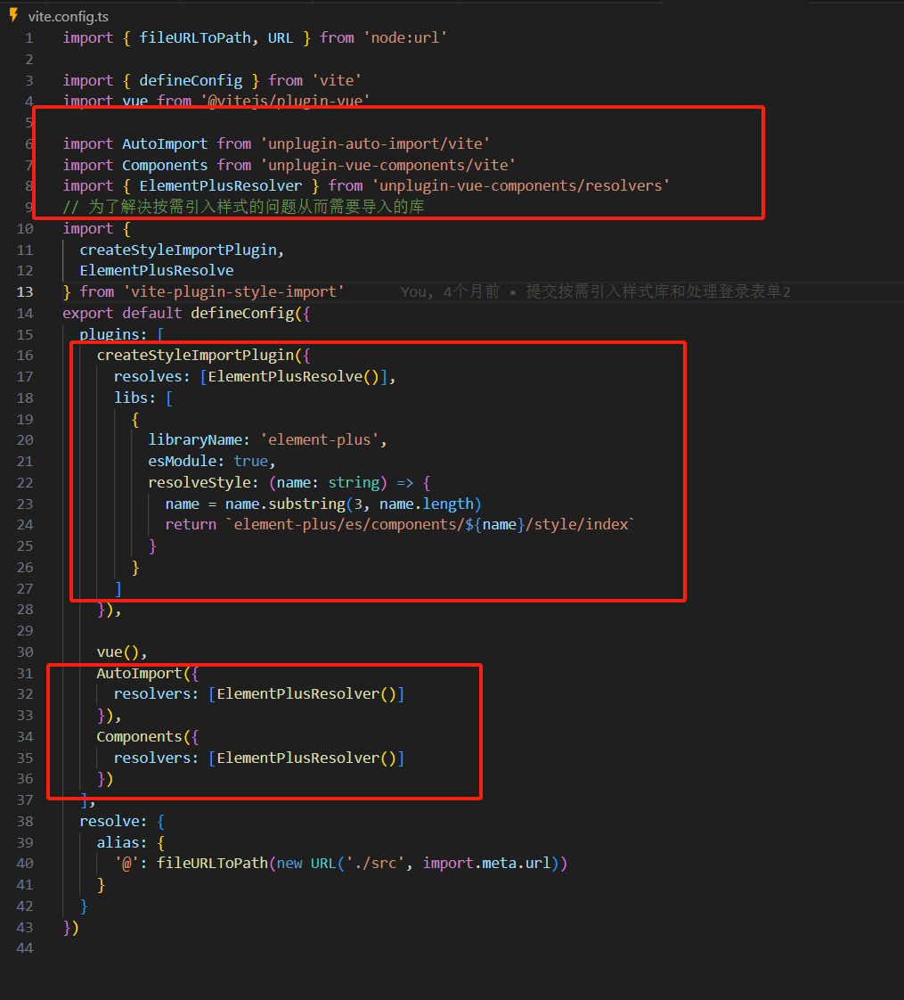
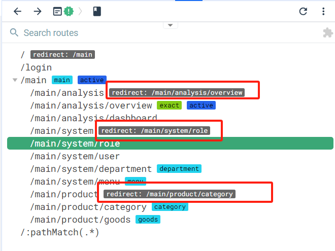

# vue3-ts-cms

This template should help get you started developing with Vue 3 in Vite.

一个手把手教你如何一步步建立基于vue3、typescript、pinia的后台管理系统

## 推荐的IDE设置

[VSCode](https://code.visualstudio.com/) + [Volar](https://marketplace.visualstudio.com/items?itemName=Vue.volar) (and disable Vetur) + [TypeScript Vue Plugin (Volar)](https://marketplace.visualstudio.com/items?itemName=Vue.vscode-typescript-vue-plugin).

## 代码规范配置

### 1.使用editorConfig统一配置

```json
# http://editorconfig.org

root = true

[*] # 表示所有文件适用
charset = utf-8 # 设置文件字符集为 utf-8
indent_style = space # 缩进风格（tab | space）
indent_size = 2 # 缩进大小
end_of_line = lf # 控制换行类型(lf | cr | crlf)
trim_trailing_whitespace = true # 去除行尾的任意空白字符
insert_final_newline = true # 始终在文件末尾插入一个新行

[*.md] # 表示仅 md 文件适用以下规则
max_line_length = off
trim_trailing_whitespace = false
```

### 2.使用prettier工具配置

pnpm install prettier -D

在.prettierrc进行配置

```json
{
 "$schema": "https://json.schemastore.org/prettierrc",
 "semi": false,
 "tabWidth": 2,
 "singleQuote": true,
 "printWidth": 80,
 "trailingComma": "none"
}
```

### 3.使用ESLint检测配置

pnpm install eslint-plugin-prettier eslint-config-prettier -D

在**.eslintrc.cjs**中进行配置

```json
module.exports = {
 root: true,
 extends: [
  'plugin:vue/vue3-essential',
  'eslint:recommended',
  '@vue/eslint-config-typescript',
  '@vue/eslint-config-prettier/skip-formatting',
  // 读取prettierrc.json里面的prettier配置，令其匹配prettier的配置效果
  'plugin:prettier/recommended'
 ],
 parserOptions: {
  ecmaVersion: 'latest'
 },
 rules: {
  'vue/comment-directive': 'off',
  'vue/multi-word-component-names': 'off',
  'no-undef': 'off'
 }
}
```


## git commit规范

### eslint自动校验工具

我们希望保证代码仓库中的代码都是符合eslint规范的，所以我们会在git commit时进行代码校验，如果不符合eslint规范，借助husky工具，本项目可以支持自动通过规范修复。

- **husky是一个git hook工具，可以帮助我们触发git提交的各个阶段：pre-commit、commit-msg、pre-push**

husky配置命令：

```shell
pnpx husky-init && pnpm install
```

**该命令执行以下操作：**

1.安装husky相关的依赖：

2.在项目目录下创建 `.husky` 文件夹：

3.在package.json中添加一个脚本：

```shell
  "lint": "eslint . --ext .vue,.js,.jsx,.cjs,.mjs,.ts,.tsx,.cts,.mts --fix --ignore-path .gitignore",
```

这保证了执行git commit的时候，会自动对代码进行lint校验。

### 统一风格工具

我们采用了Commitizen进行git提交风格统一工作。

* **Commitizen 是一个帮助编写规范 commit message 的工具**
* 在本项目中的使用方法如下：

1.安装Commitizen

```shell
pnpm install commitizen -D
```

2.安装cz-conventional-changelog，并且初始化cz-conventional-changelog：

```shell
pnpx commitizen init cz-conventional-changelog  --pnpm --save-dev --save-exact
```

3.在package.json中进行配置：

```shell
 "config": {
  "commitizen": {
   "path": "./node_modules/cz-conventional-changelog"
  }
 }
```

#### 结合commitlint来限制提交:

1.安装 @commitlint/config-conventional 和 @commitlint/cli

```shell
npm i @commitlint/config-conventional @commitlint/cli -D
```

2.在根目录创建commitlint.config.js文件，配置commitlint

```js
module.exports = {
  extends: ['@commitlint/config-conventional']
}
```

3.使用husky生成commit-msg文件，验证提交信息：

```shell
npx husky add .husky/commit-msg "npx --no-install commitlint --edit $1"
```


## 文件架构目录

#### 系统梳理和理解向导

登录业务模块=>登录的网络请求架构=>登录的pinia对应的store模块(内含所有的初始登录逻辑和鉴权设计)

鉴权关联组件=>菜单，路由，登录逻辑的相关组件

鉴权关联工具=>utils下处理鉴权和登录逻辑的工具

### assets

静态资源存放区

### base-ui

引入第三方UI配置(目前暂无，可自定义配置)

### components

组件区

### service

配置网络请求相关信息，config文件夹下包括了BASE_URL和TIME_OUT的配置。

在对应的文件夹下，不同的文件名和views文件夹下的文件名同步匹配，对应了各个模块下的service请求。

## 自定义配置

### env.d.ts

针对typescript需要编译识别的文件进行了汇总声明，使其可以匹配对应的文件类型。

我们需要在这里对Vue进行一个ts编译声明，使TS能够正确识别Vue组件。

```
// 声明一个模块，用于给typescript匹配所有以 ".vue" 结尾的文件
// 使得typeScript可以正确识别vue文件到底是一个什么类型(写明具体的模块类型)
declare module '*.vue' {
  // 从 "vue" 中导入 DefineComponent 类型
  import { DefineComponent } from 'vue'
  // 定义一个类型为 DefineComponent 的变量 component
  // 它具有三个泛型参数，分别表示组件的 props、组件的 data 和其他的类型。
  // 在这里，我们使用空对象（{}）表示没有 props，使用空对象（{}）表示没有 data，使用 any 表示其他类型可以是任意值。
  const component: DefineComponent
  // 导出 component 变量，这样其他地方在导入 ".vue" 文件时，TypeScript 编译器会将它识别为一个 Vue 组件
  export default component
}
```


### tsconfig.json

tsconfig继承(extends)于vue的tsconfig.web配置

include配置需要进行ts编译的文件

**tsconfig.node.json**

是官方推荐的修改配置的文件

### 区分development和production环境

通过VITE提供的环境变量(import.meta.env)来获取当前环境类型=>**import.meta.env.MODE**

根据MODE类型来进行不同的环境变量条件下的配置

在service的config文件下根据MODE类型的不同，来设置对应环境的BASE_URL来发起请求，借此区分开发环境和生产环境，本项目中直接使用了**import.meta.env.PROD**来进行环境区分。

当然，您也可以利用vite的env自定义功能，在根目录创建.env.production或.env.development，vue会自动识别这两种文件对应的环境配置，在各自的文件中创建对应的环境变量信息，来进行两种开发环境的区分，注意文件内部的自定义配置代码必须以**VITE_**开头。

## UI库的使用

本项目选取了element-plus作为UI库，应用了element-plus的css样式，将**按需引用**作为应用UI库的配置方法。

### 全局安装

pnpm install element-plus

### 按需引用

#### 快捷开启element-plus组件配置提示(基于Volar支持)

我们先需要对element-plus的type支持进行一个配置，使得我们可以在开发中快捷进行element-plus组件的prop类型提示配置。

 结合Volar插件(需在代码编辑器中自行安装)的支持，在**tsconfig.json**中通过**compilerOptions.type**指定全局组件类型。

我们在tsconfig.node.json中进行相关配置：


#### 按需引用的配置

```
pnpm install -D  unplugin-vue-components unplugin-auto-import
```

在vite.config.ts中进行对应的配置



同时，你需要在**tsconfig.config.json**中添加对**components.d.ts**和**auto-imports.d.ts**的支持，以便ts能够正确的识别对应模块自动导入和组件配置文件的编译支持。


**请注意，element-plus反馈组件不在自动导入的组件范围之内，建议手动进行导入，导入步骤如下：**

针对反馈插件，部分引入或者全局引入相对繁琐或者不合理，所以只需直接在vite.config.ts中配置vite-plugin-style-import 即可实现样式库的按需引入。

执行安装：

```shell
pnpm i -D vite-plugin-style-import
pnpm i -D consola
```

在vite.config.ts之中配置：

```typescript
import {
  createStyleImportPlugin,
  ElementPlusResolve
} from 'vite-plugin-style-import'
```

在plugins中写入以下配置代码：

```typescript
    createStyleImportPlugin({
      resolves: [ElementPlusResolve()],
      libs: [
        {
          libraryName: 'element-plus',
          esModule: true,
          resolveStyle: (name: string) => {
            name = name.substring(3, name.length)
            return `element-plus/es/components/${name}/style/index`
          }
        }
      ]
    })
```


### 全局注册图标(icon)

在global文件夹的register-icon.ts进行全局注册操作

```typescript
import type { App } from 'vue'
// 导入所有的icon图标
import * as ElementPlusIconsVue from '@element-plus/icons-vue'
function registerIcons(app: App<Element>) {
  for (const [key, component] of Object.entries(ElementPlusIconsVue)) {
    // 把所有图标注册成app的全局组件
    app.component(key, component)
  }
}
export default registerIcons
```

在main.ts导入该文件，利用**app.use(icons)**注册即可完成全局注册。

## 登录逻辑的向导分析 

通过在**panel-account.vue**之中发送登录信息，获取返回的信息。

本项目中多数的网络请求是利用了pinia的actions完成的异步请求，我们在登录逻辑这里定义了一个**loginAccountAction**的function，所有的登录逻辑操作都在这里面完成。

### 获取登录信息

我们先在**store**下**login**模块的**login.ts**利用actions写好对应的登录请求，用于获取登录用户的基本信息和角色信息，角色信息是为了鉴权使用的，然后我们将获取到的返回信息保存在**state**当中以供外部引用，同时我们将token保存到本地缓存之中，以便后续登录无需重复请求token。

**注意：localCache是已经封装好的本地缓存工具，封装在utils下的cache设计的类中，因为localStorage.setItem获取的值是JSON值，所以为了方便统一封装不同类型的cache值。**

##### 获取用户信息和角色信息

```typescript
    async loginAccountAction(account: IAccount) {
      // 1.账号登录，获取token等信息
      // 网络请求应该在store中进行执行，业务页面直接调用该请求完成store参数的录入即可
     const loginResult = await accountLoginRequest(account)
      const id = loginResult.data.id
      this.token = loginResult.data.token
      localCache.setCache(LOGIN_TOKEN, this.token)
      // 2.获取登录用户的详细信息(role信息)
      const userInfoResult = await getUserInfoById(id)
      const userInfo = userInfoResult.data
      this.userInfo = userInfo
    }
```

然后再在login业务模块的子组件**pane-account**之中调用**loginAccountAction**，请求就完成了。

#### 根据角色信息获取菜单的路由映射表

```typescript
 async loginAccountAction(account: IAccount) {
      /* ...省略前面的代码 */
      const userMenusResult = await getUserMenuByRoleId(this.userInfo.role_id)
      const userMenus = userMenusResult.data
      this.userMenus = [...userMenus]
    }
```

#### 本地缓存用户信息

为了防止用户刷新页面后，基于pinia机制问题，pinia中保存的用户信息和关键的菜单/鉴权信息不复存在，我们应该将其保存到本地缓存之中。

```typescript
      async loginAccountAction(account: IAccount) {
        /* ...省略前面的代码 */
      localCache.setCache(USERINFO, userInfo)
      localCache.setCache(USERMENUS, userMenus)
    }
```


#### 录入token至请求拦截器

我们需要将获取的用户token应用到网络请求的拦截器之中，确保每一次请求发送可以在拦截其中添加对应的token值。

在**service**目录下的出口文件(**index.ts**)进行拦截器中添加token的操作：

```typescript
const hyRequest = new HYRequest({
  baseURL: BASE_URL,
  timeout: TIME_OUT,
  // 利用拦截器来导入token等关键信息
  // 使得每个请求都自动携带token
  interceptors: {
    requestSuccessFn: (config) => {
      const token = localCache.getCache(LOGIN_TOKEN)
      //类型缩小操作
      if (config.headers && token) {
        config.headers.Authorization = token
      }
      return config
    }
  }
})
```


## 权限管理

### RBAC(role based access control) 基于角色的访问控制

#### 权限规划

**登录信息**

id/name/token

**角色信息**

用户的角色类型

根据id获取用户的详情信息

**权限信息**

根据角色获取对应的权限组(菜单权限，功能权限)

#### 根据角色信息录入菜单路由映射表

见 **登录逻辑的向导分析 **的 **根据角色信息获取菜单的路由映射表**  章节操作。

## 路由管理

### 设计方案

本项目采取动态路由导入的方式进行管理，基于鉴权设计来进行动态路由的分配。

我们会根据用户的权限信息，动态地添加路由。

我们要利用登录接口中请求的三块内容来完成菜单路由的导入和搭建：

1. token
2. 用户信息：角色信息(role对象)
3. 菜单信息

### 基于菜单(menu)的动态路由管理

- 我们利用userMenus数组动态地展示菜单。
- 将从后端获取到的菜单列表映射成路由对象。

我们需要后端返回上述类型的JSON数据，且对应的路由菜单应当和前端路由设计一一对应。然后我们通过pinia的login模块中的**loginAccountAction**将后端返回的菜单映射到前端的菜单列表里面进行展示。

```typescript
    async loginAccountAction(account: IAccount) {
      // ...忽略前面的代码
      const routes = mapMenusToRoutes(userMenus)
      routes.forEach((route) => {
        // 最终嵌套进去的路由还是本地定义的路由对象，用于vue-router的导航
        router.addRoute('main', route)
      })

    }
```

从**loginAccountAction**之中获取并写入pinia的state状态之后，**我们在main-menu.vue**对菜单进行导入和管理。

### 应用路由映射表

我们会提前将业务组件的路由做一个按需引入，然后导出该业务组件的详细路由信息，根据后端返回的菜单路由映射表进行匹配，动态地导入菜单。 

我们会在 **loginAccountAction**里面完成动态引入匹配的菜单路由对象。

具体步骤如下：

- 获取后端返回的路由菜单映射表，将其存入**userMenus**。

- 从该路由菜单映射表获取所有后端返回的路由对象，存在一个数组之中。

- 前端项目中(本项目)，将所有的路由对象一个个存在独立的文件当中。

- 举例说明：

  ```typescript
  const category = () => import('@/views/main/product/category/category.vue')
  export default {
    path: '/main/product/category',
    name: 'category',
    component: category,
    children: []
  }
  
  ```

- 从文件中先将所有前端写好路由对象先存档到一个数组里面，准备匹配后端返回的路由菜单映射表。

  我们通过**map-menus**中的工具类函数 **loadLocalRoutes** 来完成前端所有的路由对象的遍历存档，并将遍历处理后的路由对象数组暴露出去。

  ```typescript
  function loadLocalRoutes() {
    // 根据前端router目录下所有的路由对象动态地存入localRoutes数组之中
    const localRoutes: RouteRecordRaw[] = []
    // 6.2.利用import.meta.glob()读取router/main当中所有的ts文件
    // eager代表取消import.meta的回调函数，直接取得回调的结果
    // 添加: Record<string, any>是为了避免routerFiles的类型为unknown
    const routerFiles: Record<string, any> = import.meta.glob(
      '../router/main/**/*.ts',
      {
        eager: true
      }
    )
    // 6.3.将加载的对象放到localRoutes里面
    for (const key in routerFiles) {
      const module = routerFiles[key]
      //  module.default => 路由对象
      // 将路由对象添加到localRoutes里面
      localRoutes.push(module.default)
    }
    return localRoutes
  }
  ```
  
  
  
- 根据后端的路由菜单映射表去意义匹配，再通过**router.addRoute('main',匹配路由)**加入到路由表中。

  ```typescript
  // 这里的功能主要分为两个部分：1.根据路由映射表去匹配正确的路由 2.加载面包屑
  export function mapMenusToRoutes(userMenus: any[]) {
    // 1.先加载本地的路由
    const localRoutes = loadLocalRoutes()
    // 2.根据路由映射表去匹配正确的路由
    // 先把前端本地路由映射表的路由全部汇总进来，然后再从后端获取的路由映射表进行匹配
    const routes: RouteRecordRaw[] = []
    for (const menu of userMenus) {
      for (const submenu of menu.children) {
        const route = localRoutes.find((route) => route.path === submenu.url)
        // 有可能不存在，所以需要判断
        if (route) {
          // 给顶层的菜单(可以理解为一级面包屑)添加重定向功能，但是只需要执行第一次即可
          // 所以需要再添加下文的判断，即只有当routes中不存在menu.url时，才添加重定向功能
          // 简而言之，就是给routes里面添加一个父路由对象，内面的重定向指向第一个子路由
          if (!routes.find((item) => item.path === menu.url)) {
            // 下文的作用是为了点击一级面包屑时，跳转到二级面包屑的第一个路由
            routes.push({ path: menu.url, redirect: route.path })
          }
          // 将二级菜单对应的路由添加到路由映射表中
          routes.push(route)
        }
        // 记录第一个被匹配到的路由映射对象，即从后端获取的路由映射表列表中选取第一个路由映射表
        if (!firstMenu && route) firstMenu = submenu
      }
    }
    return routes
  }
  ```

- 获取到匹配的路由之后，我们再在**login.ts**之中通过调用 **mapMenusToRoutes** 并传入一个后端返回的映射路由表，完成前后端路由鉴权匹配，并将其正式添加进前端路由router之中：

  ```typescript
             // ...忽略前面的代码
  	   const routes = mapMenusToRoutes(userMenus)
          routes.forEach((route) => {
            router.addRoute('main', route)
          })
```
  
当然请注意，在 **login.ts**里面，要针对已登录和未登录的场景分别进行路由导入处理。
  


### 在已登录的情况下应用路由映射表

我们需要在注册路由表( **app.use(router)**)之前，抢先进行是否登录的验证，所以我们需要结合项目入口文件 **main.ts** 中的 **app.use(store)** 操作里面，进行是否登录的验证，已登录的操作逻辑写在 **login.ts**之中：

**main.ts**

```typescript
// ...忽略前面的代码

// 刷新获取路由映射表(已授权情况下)应该建立在pinia的架构创建之后,所以这里统一封装到store的出口文件之中
/* 这里有一点必须要注意，路由的注入/注册不依赖于app.use(router)是否建立
   但是！app.use(router)如果先一步执行，建设出来的路由映射表只有静态路由，
   所以应该先注册路由，再执行app.use(router)
*/
app.use(store)
// 在路由全部注册完毕之后再加载router,防止在main页面刷新时路由守卫失效
// 在login页面登录的时候，app.use(router)的执行顺序并不重要，因为login页面并没有路由守卫，
// 也用不上对应的路由映射表，所以不会出现路由守卫失效的情况
app.use(router)
```

**login.ts**

```typescript
// ...忽略前面的代码

	/* 默认在已登录的情况下，刷新页面后再次获取符合权限的路由映射表 */
    loadLocalCacheAction() {
      // 用户刷新默认加载数据
      const token = localCache.getCache(LOGIN_TOKEN)
      const userInfo = localCache.getCache(USERINFO)
      const userMenus = localCache.getCache(USERMENUS)
      // 只有token，个人信息，路由映射表都存在时才进行路由路由映射表的数据加载(代表验证登录成功)
      if (token && userInfo && userMenus) {
        this.token = token
        this.userInfo = userInfo
        this.userMenus = userMenus
        // 在已登录的情况下为了获取路由映射表，调用mapMenusToRoutes获取符合权限的路由映射表
        const routes = mapMenusToRoutes(userMenus)
        routes.forEach((route) => {
          router.addRoute('main', route)
        })
      }
    }
```

**store入口文件 index.ts**

```typescript
// ...忽略前面的代码

   app.use(pinia)
  // 2.加载本地的数据
  // loadLocalCacheAction的调用是为了确保在已登录的情况下，
  // 刷新页面时，依然可以得到根据用户权限获取的路由映射表
  const loginStore = useLoginStore()
  loginStore.loadLocalCacheAction()
```


### 正确跳转首次加载路由

我们获取到前后端匹配完成的路由映射表后，第一个跳转的路由应该是该路由映射表的第一条路由对象：

```typescript
export function mapMenusToRoutes(userMenus: any[]) {
// ...忽略前面的代码

// 这是首次加载路由，单独定义并导出该全局变量(首次加载的路由)
export let firstMenu: any = null
export function mapMenusToRoutes(userMenus: any[]) { 
// 记录第一个被匹配到的路由映射对象，即从后端获取的路由映射表列表中选取第一个路由映射表
      if (!firstMenu && route) firstMenu = submenu
	}
}
```

随后我们在router的入口文件 **index.ts**中对**firstMenu**进行应用：

```typescript
import { firstMenu } from '@/utils/map-menus'
// ...忽略前面的代码
router.beforeEach((to, from) => {
  const token = localCache.getCache(LOGIN_TOKEN)

  if (to.path.startsWith('/main') && !token) {
    // 只有拥有token，才能正常进入main
    return '/login'
  }
  // 在前置守卫的连接操作中，针对已登录的情况下，如果登录操作完成时在main页面并且token存在
  if (to.path === '/main' && token) {
    return firstMenu?.url
  }
})
```


## 菜单管理

我们需要同步路由默认跳转路由，对菜单进行同步定位。

我们通过当前url的路径去匹配菜单路径，所以我们需要一个工具函数 **mapPathToMenu** 来辅助我们去匹配正确的菜单。

### 同步菜单路由定位

**main-menu**

```vue
<template>
  <div class="main-menu">
    <div class="menu">
      <!-- menu -->
      <el-menu
        :collapse-transition="false"
        :default-active="defaultActive"
        :collapse="isFold"
        text-color="#b7bdc3"
        active-text-color="#fff"
        background-color="#001529"
      >
        //...省略中间代码
      </el-menu>
    </div>
  </div>
</template>
<script setup lang="ts">
// 获取当前路由
const route = useRoute()
const defaultActive = computed(() => {
  // 触发computed的关键在于pathMenu的值会根据route.path的变化而变化
  const pathMenu = mapPathToMenu(route.path, userMenus)
  return pathMenu.id + ''
})
</script>
```

**map-menus**

```typescript
/**
 * 根据路径去匹配需要显示的菜单,适用于根据当前页面的路由地址，匹配到对应的菜单
 * @param path 需要匹配的路径
 * @param userMenus 后端返回的所有的菜单
 */
export function mapPathToMenu(path: string, userMenus: any[]) {
  for (const menu of userMenus) {
    for (const submenu of menu.children) {
      // 寻找等于传入path的路由映射
      if (submenu.url === path) {
        return submenu
      }
    }
  }
}
```


### 面包屑导航

我们需要面包屑的导航路径显示和菜单同步，且可以完成点击跳转功能。

我们需要动态地通过遍历循环的方式将路由映射表中的路径正确导入到面包屑组件之中，所以我们也需要结合业务组件来编写一个工具函数予以应用：

**map-menus**

```typescript
// 需要两个传参：当前的路由地址，和后端返回的所有的路由映射菜单
export function mapPathToBreadcrumbs(path: string, userMenus: any[]) {
  const breadcrumbs: IBreadcrumbs[] = []
  // 遍历路由映射表，获取获取对应层级的面包屑
  for (const menu of userMenus) {
    for (const submenu of menu.children) {
      // 寻找传入path的路由映射,将其层级的信息添加到面包屑中
      if (submenu.url === path) {
        // 一级面包屑
        breadcrumbs.push({ name: menu.name, path: menu.url })
        // 二级面包屑
        breadcrumbs.push({ name: submenu.name, path: submenu.url })
      }
    }
  }
  return breadcrumbs
}
```

**header-crumb**

```vue
<template>
  <div class="crumb">
    <el-breadcrumb separator-icon="CaretRight">
      <template v-for="item in breadcrumbs" :key="item.name">
        <el-breadcrumb-item :to="item.path">{{ item.name }}</el-breadcrumb-item>
      </template>
    </el-breadcrumb>
  </div>
</template>

<script setup lang="ts">
import { mapPathToBreadcrumbs } from '@/utils/map-menus'
import { useRoute } from 'vue-router'
import useLoginStore from '@/store/login/login'
import { computed } from 'vue'
// 获取当前路由
const route = useRoute()
// 获取后端路由映射表
const userMenus = useLoginStore().userMenus
const breadcrumbs = computed(() => {
  // 每次route.path一变动，mapPathToBreadcrumbs就返回新的值
  return mapPathToBreadcrumbs(route.path, userMenus)
})
</script>

<style lang="less" scoped>
.header-crumb {
}
</style>

```


### 点击父路由的重定向

为了防止在面包屑和菜单栏点击父路由时的跳转出现空白页面或错误页面，我们需要为点击父级路由增加一个重定向功能。

我们在**map-menus**中的**mapMenusToRoutes**中实现这个功能。

```typescript
// 这里的功能主要分为两个部分：1.根据路由映射表去匹配正确的路由 2.加载面包屑
export function mapMenusToRoutes(userMenus: any[]) {
  // 1.先加载本地的路由
  const localRoutes = loadLocalRoutes()
  // 2.根据路由映射表去匹配正确的路由
  // 先把前端本地路由映射表的路由全部汇总进来，然后再从后端获取的路由映射表进行匹配
  const routes: RouteRecordRaw[] = []
  for (const menu of userMenus) {
    for (const submenu of menu.children) {
      const route = localRoutes.find((route) => route.path === submenu.url)
      /* 实现功能：为顶层的菜单(可以理解为一级面包屑)添加重定向功能，定位到实际存在业务页面的二级菜单，但是只需要执行第一次 */
      // 可能前后端路由因为权限问题无法对齐(后端路由缺失)，所以需要进行判断
      if (route) {
        // 给routes里面添加一个父路由对象，内面的重定向指向第一个子路由
        // 防止点击父级路由时，页面显示空白
        if (!routes.find((item) => item.path === menu.url)) {
          // 下文的作用是为了点击一级面包屑时，跳转到二级面包屑的第一个路由
          routes.push({ path: menu.url, redirect: route.path })
        }
        // 将二级菜单对应的路由添加到路由映射表中
        routes.push(route)
      }

    }
  }
  return routes
}
```



具体业务页面的默认active路径代码不做展示，用computed进行动态获取active路径即可。


## 国际化

使用element-plus的**config-provider**组件，对项目进行国际化处理。

**App.vue**

```vue
<template>
  <div class="app">
    <ElConfigProvider :locale="locale">
      <router-view />
    </ElConfigProvider>
  </div>
</template>

<script setup lang="ts">
/* 国际化操作 */
import type { ElConfigProvider } from 'element-plus'
import { ref } from 'vue'
// mjs 文件默认无法识别，所以需要在env.d.ts中声明
import zhCn from 'element-plus/dist/locale/zh-cn.mjs'

const locale = ref(zhCn)
</script>

<style scoped></style>

```


## 项目启动

```sh
pnpm install
```

Compile and Hot-Reload for Development

```sh
pnpm run dev
```

Type-Check, Compile and Minify for Production

```sh
pnpm run build
```

Lint with [ESLint](https://eslint.org/)

```sh
pnpm run lint
```

